# Architecture de l'Orchestrateur

## Vue d'ensemble

L'orchestrateur (`SurveillanceOrchestrator`) est le composant central qui coordonne tous les éléments du système.

## Composants Internes

### 1. Gestionnaire de Mémoire Intelligent
```python
class IntelligentMemoryManager:
    - pattern_detector: PatternDetector
    - contextual_learning: ContextualLearning  
    - memory_cache: Cache optimisé
```

**Fonctionnalités** :
- Détection automatique de patterns suspects/normaux
- Apprentissage contextuel par section
- Cache intelligent pour les performances
- Optimisation automatique de la mémoire

### 2. Pipeline d'Analyse

```mermaid
graph LR
    A[Vidéo] --> B[Extraction Frames]
    B --> C[Analyse VLM]
    C --> D[Contexte Intelligent]
    D --> E[Décision LLM]
    E --> F[Apprentissage]
    F --> G[Sauvegarde]
```



**Étapes détaillées** :
1. **Preprocessing** : Extraction frames avec keyframes intelligents
2. **VLM Analysis** : Analyse visuelle avec modèle adaptatif
3. **Context Building** : Construction contexte enrichi par l'historique
4. **LLM Decision** : Prise de décision avec recommandations IA
5. **Learning** : Mise à jour des patterns et statistiques
6. **Storage** : Sauvegarde optimisée avec compression

### 3. Optimisations Automatiques

#### Gestion Mémoire GPU
```python
def _analyze_with_vlm(self, frames, section, time_of_day, crowd_density):
    with memory_monitor(f"Analyse {section}"):
        if memory_optimizer.check_memory_pressure():
            memory_optimizer.aggressive_cleanup()
        
        vlm = create_vlm_model()
        return vlm.analyze_surveillance_scene(frames, ...)
```

#### Recommandations Intelligentes
```python
# Le système recommande automatiquement le meilleur modèle
recommended_model = self.memory.get_model_recommendation(context)
if recommended_model:
    logger.info(f"💡 Modèle recommandé par l'IA: {recommended_model}")
```

## Mémoire Contextuelle Avancée

### Apprentissage des Patterns
```python
class PatternDetector:
    def add_observation(self, context, decision):
        pattern = {
            "section": context.get("section"),
            "time": context.get("time"), 
            "density": context.get("density"),
            "suspicion_level": decision.get("suspicion_level"),
            "confidence": decision.get("confidence")
        }
        
        if decision.get("suspicion_level") in ["medium", "high"]:
            self.suspicious_patterns.append(pattern)
```

### Apprentissage Contextuel
```python
class ContextualLearning:
    def update_section_stats(self, section, decision, metadata):
        stats = self.section_statistics[section]
        stats["total_analyses"] += 1
        stats["alerts"][decision.get("alert_type")] += 1
        stats["confidence_scores"].append(decision.get("confidence"))
```

## API Publique

### Méthodes Principales
```python
orchestrator = SurveillanceOrchestrator()

# Analyse complète
result = orchestrator.analyze(
    video_path="video.mp4",
    section="Rayon cosmétique", 
    time_of_day="Après-midi",
    crowd_density="dense",
    use_keyframes=True
)

# Insights intelligents
insights = orchestrator.get_section_insights("Rayon cosmétique")
stats = orchestrator.get_session_stats()

# Optimisation
orchestrator.optimize_contextual_memory()
orchestrator.switch_to_kim()  # Si disponible
```

### Statistiques Avancées
```python
stats = orchestrator.get_session_stats()
print(f"Intelligence: {stats['intelligence']}")
# Output:
{
    "total_patterns": 25,
    "suspicious_patterns": 8,
    "sections_learned": 4,
    "models_tracked": 2,
    "learning_iterations": 150
}
```

## Performance et Optimisation

### Auto-Configuration
L'orchestrateur s'auto-configure selon les ressources :

- **GPU < 4GB** : SmolVLM, batch_size=1, cleanup=True
- **GPU 4-8GB** : SmolVLM/KIM, batch_size=2, optimisé  
- **GPU > 8GB** : KIM privilégié, batch_size=4+, performances max

### Monitoring en Temps Réel
```python
# Surveillance automatique de la mémoire
with memory_monitor("Analyse Section A"):
    result = orchestrator.analyze(...)
    # Logs automatiques des variations mémoire
```

### Cache Intelligent
- **Cache mémoire** : 5 minutes pour les données fréquentes
- **Patterns** : Garde les 50 patterns les plus récents
- **Événements** : Limite à 1000 événements en mémoire
- **Alertes** : Rétention 30 jours automatique