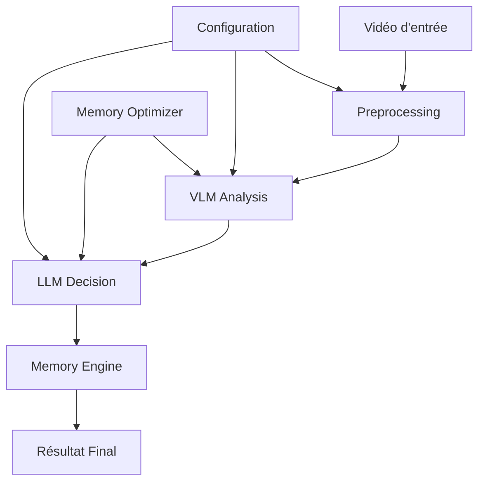

# Vue d'ensemble de l'Architecture

## Architecture Générale

Le Surveillance Orchestrator utilise une architecture modulaire à trois niveaux :

## Composants Principaux

### 1. Couche d'Entrée
- **Preprocessing** : Extraction et optimisation des frames vidéo
- **Configuration** : Gestion centralisée des paramètres
- **Validation** : Vérification des formats et ressources

### 2. Couche Intelligence
- **VLM (Vision-Language Model)** : Analyse visuelle des scènes
- **LLM (Language Model)** : Prise de décision contextuelle  
- **Memory Engine** : Apprentissage et mémorisation des patterns

### 3. Couche Optimisation
- **Memory Optimizer** : Gestion intelligente de la mémoire GPU/CPU
- **Model Manager** : Chargement/déchargement automatique des modèles
- **Pattern Detector** : Détection et apprentissage des comportements

## Flux de Données

### Analyse Standard
1. **Extraction** : Frames extraites de la vidéo
2. **Préprocessing** : Optimisation pour les modèles VLM
3. **Analyse VLM** : Description de la scène
4. **Décision LLM** : Évaluation du niveau de risque
5. **Apprentissage** : Mémorisation pour futures analyses

### Mémoire Contextuelle
1. **Pattern Learning** : Détection de patterns suspects/normaux
2. **Section Analytics** : Statistiques par zone surveillée
3. **Model Performance** : Tracking des performances des modèles
4. **Contextual Alerts** : Alertes enrichies par l'historique

## Adaptabilité

### Configuration Automatique
Le système s'adapte automatiquement selon les ressources :

- **GPU Detection** : Auto-configuration selon la VRAM disponible
- **Model Selection** : Choix optimal SmolVLM vs KIM
- **Batch Optimization** : Ajustement automatique des tailles de lot
- **Memory Management** : Nettoyage intelligent selon l'usage